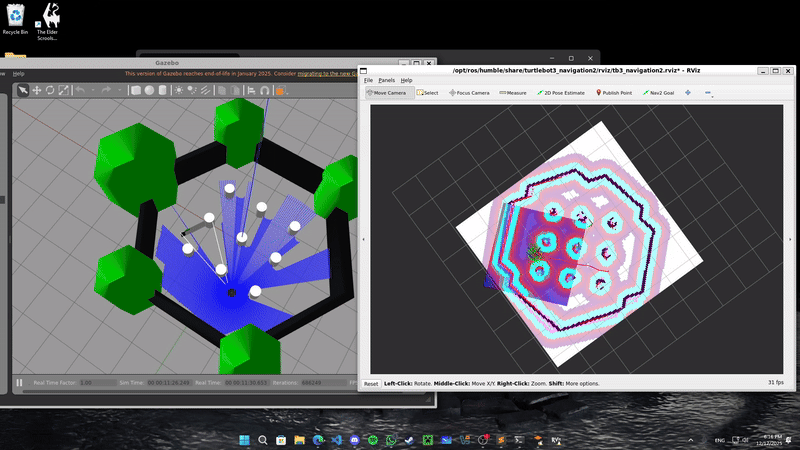
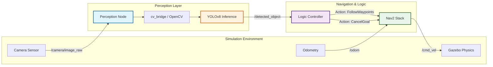

# Autonomous Visual Patrol & Anomaly Detector

This project is a ROS2 Humble implementation of an autonomous surveillance agent on the TurtleBot3 platform. It integrates **Navigation2 (Nav2)** for waypoint following and **YOLOv8** for real-time semantic object detection.

The primary goal of this work was to engineer a feedback loop between a navigation stack and a perception system, allowing a robot to interrupt its patrol task upon detecting anomalies—simulating a real-world security or inspection scenario.

<table style="width:100%">
  <tr>
    <th width="50%">Simulation Environment & Sensor Fusion (Gazebo)</th>
  </tr>
  <tr>
    <td></td>
  </tr>
</table>

## System Architecture

The system is designed as a decoupled state machine where the logic controller arbitrates between navigation goals and perception events.


### Core Components

1.  **Perception Node:**
    * Subscribes to `/camera/image_raw`.
    * Performs inference using a quantized YOLOv8 Nano model (optimized for CPU).
    * Publishes detected class IDs to `/detected_object`.
2.  **Navigation Controller:**
    * Interfaces with the Nav2 Action Server via the Simple Commander API.
    * Manages the patrol loop and handles **Goal Preemption** (canceling the active path) when high-priority sensor data is received.

## Technical Implementation

### 1. Coordinate Transformations (TF2)
A core challenge in robotics is mapping 2D pixel data to 3D world coordinates. For the robot to effectively "inspect" an object, the visual detection must be contextualized within the global map frame.

The pose of a detected object ($P_{map}$) is derived using the transformation chain defined in the TF tree:

$$
P_{map} = T_{map \rightarrow odom} \times T_{odom \rightarrow base\_link} \times T_{base\_link \rightarrow camera} \times P_{camera}
$$

Where the static transform from the robot base to the camera is defined as:

$$
T_{base \rightarrow camera} =
\begin{bmatrix}
R & t \\
0 & 1
\end{bmatrix}
$$

This ensures that regardless of the robot's orientation ($yaw$) or the camera's mounting offset, the detection event is spatially accurate.

### 2. Handling Dependency Conflicts
During development, a binary incompatibility was identified between the ROS2 Humble middleware and the latest YOLOv8 library.
* **Issue:** `cv_bridge` (ROS2 image converter) is linked against NumPy 1.x C-API.
* **Conflict:** YOLOv8 installs NumPy 2.x by default, causing an ABI mismatch and immediate segmentation faults.
* **Resolution:** The environment is explicitly pinned to `numpy<2.0` to ensure stability without recompiling the ROS source code.

## Installation & Usage

### Prerequisites
* **OS:** Ubuntu 22.04 LTS (Jammy Jellyfish)
* **Middleware:** ROS2 Humble
* **Language:** Python 3.10

### Build Instructions
```bash
mkdir -p ~/robot_ws/src
cd ~/robot_ws/src
git clone https://github.com/mertaren/tb3_autonomy_core.git
cd ..
rosdep install --from-paths src -y --ignore-src
colcon build --symlink-install
source install/setup.bash
```

### Execution - Step 1: Launch Simulation
```bash
export TURTLEBOT3_MODEL=waffle_pi
ros2 launch turtlebot3_gazebo turtlebot3_world.launch.py
```

### Execution - Step 2: Initialize Navigation
```bash
ros2 launch turtlebot3_navigation2 navigation2.launch.py map:=$(ros2 pkg prefix tb3_autonomy)/share/tb3_autonomy/maps/my_house.yaml use_sim_time:=True
```

### Execution - Step 3: Start the Agent
```bash
# Terminal 1: Perception Layer
ros2 run tb3_autonomy perceptor

# Terminal 2: Logic Controller
ros2 run tb3_autonomy navigator
```
## Future Improvements

While the current implementation relies on a Python-based state machine, future iterations aim to improve scalability and robustness:

* **Behavior Trees (XML):** Migrating the logic to a native Nav2 Behavior Tree to handle complex recovery behaviors (e.g., backing up if the object is too close).
* **Depth Integration:** Currently, the system detects the *existence* of an object. Integrating a Depth Camera (RGB-D) would allow calculating the precise $Z$ distance to the target.
* **Containerization:** Dockerizing the simulation and dependency environment to solve reproducibility issues across different OS versions.